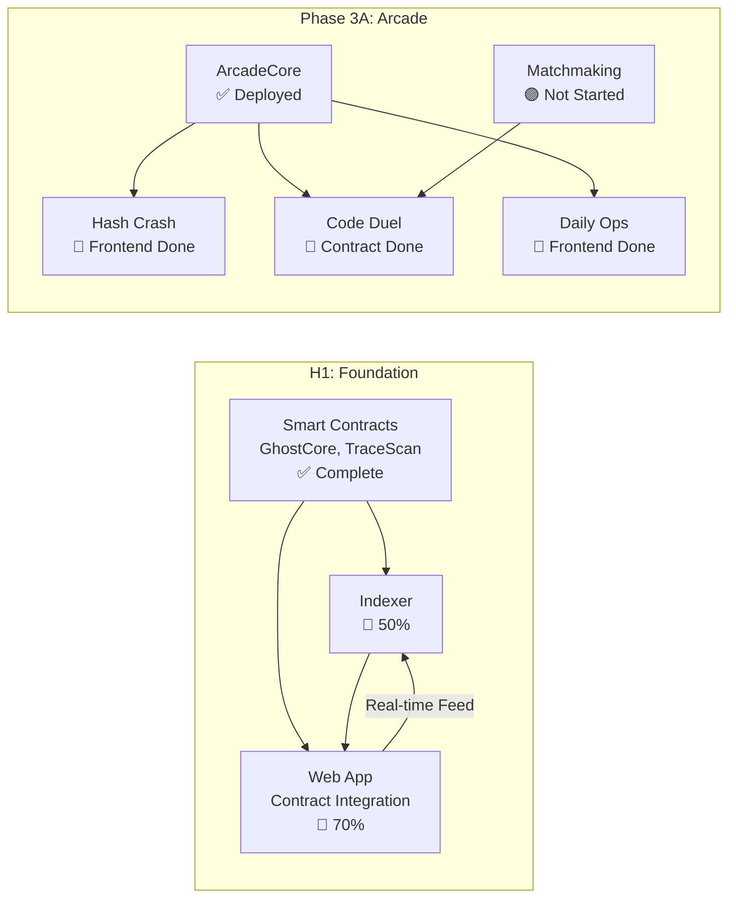

# Dependency Graph

## Critical Path



---

## Current Blockers

*No hard blockers currently. Dependencies are being worked in parallel.*

---

## Upcoming Dependencies

### [[EPIC-001-core-game-loop]]

The core game loop requires all three layers to integrate:

- **Web App** depends on:
  - Contract ABIs exported → ✅ Done
  - Indexer WebSocket API → 🚧 In Progress
  
- **Real-time Feed** depends on:
  - Indexer event processing → 🚧 In Progress
  - TimescaleDB storage → 🚧 In Progress

### Phase 3A: CODE DUEL

- **Frontend** depends on:
  - Matchmaking service → 🟣 Not Started (`services/arcade-coordinator`)
  - DuelEscrow contract deployed → ⬜ Pending
  
- **Matchmaking Service** depends on:
  - Nothing (can be built independently)

---

## External Dependencies

| Dependency | Owner | Status | Needed By |
|------------|-------|--------|-----------|
| MegaETH Testnet | MegaETH | ✅ Available | Now |
| MegaETH Mainnet Access | MegaETH | 🟣 On waitlist | Mainnet launch |
| Security Audit | External Firm | 🟣 Not scheduled | Week 12 |
| Gelato Automation (optional) | Gelato | 🧠 Evaluating | Keeper automation |

---

## Visualization

### MVP Critical Path

```
Smart Contracts ────────────────────────────────────────────────►
     ✅ 100%                                                      │
                                                                  │
Indexer ───────────────────────────────────────────►              │
     🚧 50%                                          │            │
                                                     │            │
Web App ─────────────────────────────────────────────┼────────────┤
     🚧 70%                                          │            │
                                                     ▼            ▼
                                              Real-time Feed   MVP Complete
```

### Arcade Dependencies

```
ArcadeCore (✅ Deployed)
    │
    ├──► Hash Crash (🚧 Frontend Done)
    │         └──► E2E Testing (⬜)
    │
    ├──► Daily Ops (🚧 Frontend Done)
    │         └──► Testnet Deploy (⬜)
    │
    └──► Code Duel (🚧 Contract Done)
              │
              └──► Matchmaking Service (🟣)
                        └──► Frontend (⬜)
```

---

## Parallel Work Opportunities

### Can Be Parallelized (No Dependencies)

- Indexer development ∥ Web contract integration — Different layers, same goal
- Hash Crash E2E ∥ Daily Ops deploy — Independent games
- Matchmaking service ∥ Code Duel frontend prep — Backend vs frontend

### Must Be Sequential

- Indexer → Real-time feed — Feed needs WebSocket API
- Matchmaking → Code Duel full integration — Frontend needs backend
- Audit → Mainnet deploy — Hard security requirement

---

## Resolved (Archive)

*No resolved dependencies yet — project in early phases.*

---

## Related Documents

- [[status]] - Current project status
- [[blueprint/roadmap]] - Where we're going
- [[epics/EPIC-001-core-game-loop/epic]] - Primary epic

---

*Last updated: 2026-01-27. Update during sprint planning and when blockers are identified/resolved.*
